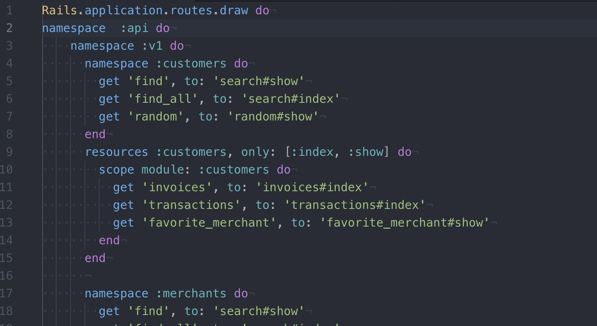

# Rails Engine

Rails Engine is a solo project for Module 3 of the [Back-End Engineering Program](https://turing.io/programs/back-end-engineering/) at the [Turing School of Software & Design](https://turing.io/). The project specifcations can be found [here](http://backend.turing.io/module3/projects/rails_engine). In this project, I used Ruby on Rails and ActiveRecord to build a versioned JSON API for sales data for a fictional shop. The project uses [Fast JSON:API](https://github.com/Netflix/fast_jsonapi) and adheres to the [JSON:API](https://jsonapi.org/) specifications. Some of my thoughts around building the project can be found on my [Medium article](https://medium.com/@annasmolentzov/the-little-rails-engine-that-could-85cb6b9f3029). 


## Features
### Record Endpoints 
The API features record endpoints for Customers, Invoices, Invoice Items, Items, Merchants, and Transactions. It can return all of the records by indicating the record type as follows: 
```
GET /api/v1/merchants.json
```
It can also return a single record from any of the record types: 
```
GET /api/v1/invoices/12.json
```
### Finders
For each data category you can find a single record based on any of the record attributes, e.g. name, description, etc. 
```
GET /api/v1/items/find?parameters
GET /api/v1/items/find?name=widget
```
You can also find multiple records based on any of the record attributes: 
```
GET /api/v1/items/find_all?parameters
GET /api/v1/items/find_all?description=neat
```

### Random
Each data category can also return a random record: 
```
GET /api/v1/invoices/random.json
```

### Relationship Endpoints
In addition to the basic record endpoints, the API provides relationship endpoints such that you can return e.g. all items belonging to a merchant, all items belonging to an invoice, etc. This is done using nested URLs, for example: 
* `GET /api/v1/merchants/:id/items` returns a collection of items associated with that merchant
* `GET /api/v1/merchants/:id/invoices` returns a collection of invoices associated with that merchant from their known orders

### Business Intelligence Endpoints
10 business intelligence endpoints are also built in to provide some insight into the data. For example: 
* `GET /api/v1/merchants/:id/revenue` returns the total revenue for that merchant across successful transactions
* `GET /api/v1/merchants/:id/revenue?date=x` returns the total revenue for that merchant for a specific invoice date x

### Learning Goals
* Learn how to to build Single-Responsibility controllers to provide a well-designed and versioned API.
* Learn how to use controller tests to drive your design.
* Use Ruby and ActiveRecord to perform more complicated business intelligence.

## Installation
### Local Setup
If you wish to install our app locally, you can fork or clone the repository here. Installation steps once cloned are as follows: 
Install the gem packages
```
$ bundle install
```
Set up the database
```
$ rake db:create
$ rake db:migrate
$ rake db:seed
```

### Running Tests
Once the app is installed locally, you can run the test suite: 
```
$ rspec
```

## Built With: Technologies and Versions
* [Ruby 2.4.5](https://ruby-doc.org/core-2.4.5/)
* [Rails 5.2.2](https://guides.rubyonrails.org/)
* [RSpec](http://rspec.info/)
* [Capybara](https://github.com/teamcapybara/capybara/blob/3.12_stable/README.md)
* [Fast JSON:API](https://github.com/Netflix/fast_jsonapi)

## Author
**[Anna Smolentzov](https://github.com/asmolentzov)**

## Acknowledgements
I would like to thank our fantastic Mod 3 instructors [Mike](https://github.com/mikedao) and [Sal](https://github.com/s-espinosa) for your help with this project and in general at Turing!